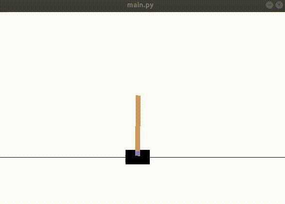

# Inverses Pendel mit Reinforcement Learning

In this repository controll of  inverse pendel has been implemented

## Q-Learning with GYM cartpole:

1) Install the requirements.txt with ' pip install requirments.txt '
2) the settings of the training can be changed in config.py
3) navigate to /Q-learning_premade for training run: 'python main.py -t'
    after this a .npy file with the Q-table will be saved
   
4) The Q-table can be used and visulised via 'python main.py'

 

 

The space-state of the cartpole was implemented in this repository:
https://github.com/openai/gym/blob/master/gym/envs/classic_control/cartpole.py

##TODO:
 * Impalement DQN
 * Impalement DDQN
 
## Authors:
* **Danial Hezarkhani**

## License

This project is licensed under the MIT License
