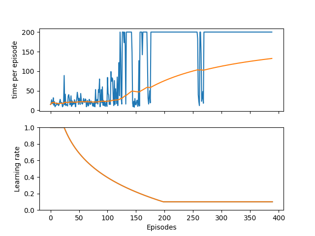

# Inverses Pendel mit Reinforcement Learning

In this reposetory inverse pendel has been implemented in two different ways

## With GYM cartpole:

1) Install the requirements.txt with ' pip install requirments.txt '
2) the settings of the training can be changed in config.py
3) navigate to /Q-learning_premade for training run: 'python main.py -t'
    after this a .npy file with the Q-table will be saved
   
4) The Q-table can be used and visulised via 'python main.py'

Reference-style: 

## With Inverse pendel from ground up:
